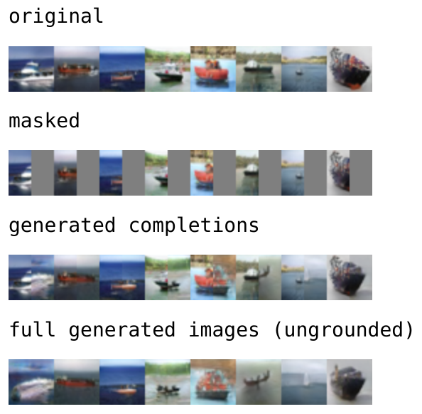

# inpaint-gan

This was an experiment to use Langevin sampling and a pre-trained GAN for image inpainting.

**Disclaimer:** this repo implements a random idea/experiment, and doesn't represent polished work or something to use in production. The idea turned out now to work very well, anyway.

Currently this repo is based on the GANs from [stylegan2-ada-pytorch](https://github.com/NVlabs/stylegan2-ada-pytorch).

# How it works

[Sohl-Dickstein et al](https://arxiv.org/abs/1503.03585) propose a simple way to condition a diffusion model. If you have a classifier `p(y|x)` and a diffusion model over `p(x)`, then a small change in each sampling step can be used to sample from `p(x)p(y|x)`.

To apply the above idea to GANs, we can write a diffusion model `p(z)` over the GAN latent space. If the latents are Gaussian, then the diffusion model can be written down in closed form. The classifier `p(y|z)` can be implemented in image space by evaluating `p(y|G(z))` where we sample `z` one or more times from the diffusion process. The resulting algorithm looks like SGD over the latent vector `z`, but with noise injected into each step (like Langevin sampling).

So this tells us how to condition a GAN on some classifier, but how does this relate to inpainting? Well, we can write down a special "classifier" that simply returns the MSE between the unmasked part of the image and the original image. This can be seen as the log-likelihood of the unmasked region under a diagonal Gaussian distribution. While this is a rough approximation of the true image distribution, it may work in practice!

# Results

Here are some completions from a CIFAR-10 model using 500 Langevin steps. This can be reproduced with the [experiments.ipynb](experiments.ipynb) notebook:

The main issue with this method seems to be that it requires SGD to find points in latent space which generate the unmasked region of the image. This actually seems to be non-trivial, so the inpainted samples never actually match up perfectly with the original image. We can see this by tracking the "energy function", i.e. the MSE between the generated and original image region.

The main hyperparameters to be tuned from the above method are:

 * Number of `z` samples (and `G` evals) per step. More means less noise in `p(y|z)`, and possibly better exploration over `z`.
 * Number of Langevin steps. More means that the diffusion conditioning approximation is more accurate.
 * Temperature of `z` samples; 1.0 is unbiased, 0.0 is much lower variance and makes optimization easier. With temperature 0.0, more than one `z` sample per Langevin step is redundant.
 * Gradient clipping. Without clipping the gradients of the MSE w.r.t. `z`, sampling often explodes.
